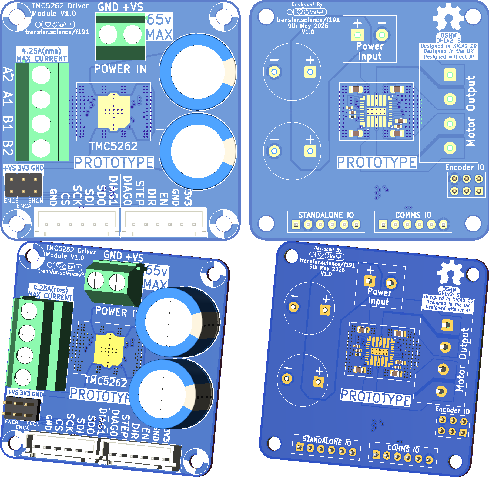
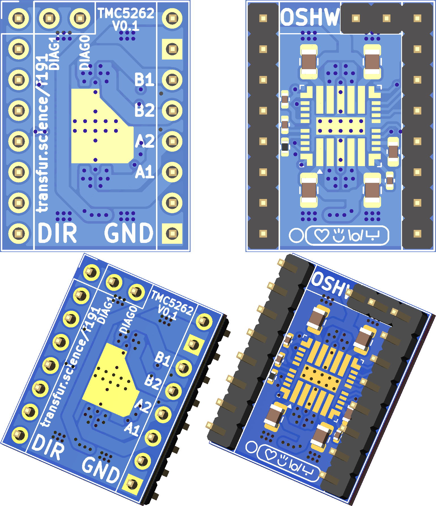

# TMC5262
This repository contains KiCAD 10.0 files for two stepper-motor driver boards based on the Trinamic [TMC5262](https://www.analog.com/en/products/tmc5262.html) driver.

**Notice:** As of May 9th 2026, these boards have not yet been tested. The initial release of these boards contains the text 'PROTOTYPE' on the silkscreen to reflect this.

You will have errors on opening the files if you do not have the [nasin-nanpa font](https://github.com/ETBCOR/nasin-nanpa) installed, used by me for both marking my name and occasionally eastereggs.

These files contain LCSC P/Ns for the SMD components and, on the external board the two large capacitors. Specific P/Ns are not provided for other through-hole components.

While these files are intended to be compatible with JLCPCB assembly, as of May 9th 2026 only Digikey is [selling the driver IC](https://www.digikey.com/en/products/detail/analog-devices-inc-maxim-integrated/TMC5262AFV/29292344), thus you will have to solder this component yourself or consign the chips to JLCPCB.

## External Driver:

This is a larger board intended for fully-testing the driver and all its features.

The files for this board are located in the *'Motor-TMC5262-external'* directory.

- **Dimensions:** 50x50mm PCB, with 43x3mm M3 mounting holes.
-**Voltage Input:** 65v max, 1x2 5.08mm-Pitch screwterminal
- **Coil Output:** 4A max, 1x4 5.08mm-Pitch screwterminal
- **DIAG0 & DIAG1:** DIAG0 is on the 'STANDALONE IO' connector, DIAG1 is on the 'COMMS IO' connector. Connecting of both or either is not required.
- **Encoder:** ENCN, ENCA, ENCB pins broken-out to 2x3 header
- **Brake Resistor:** None built-in, use header to connect externally
- **Connectivity:** Connects to the MCU using two 6-pin JST-XH connectors

## Stepstick Driver:

This is a small board intended for testing compatibility with existing stepstick-based mainboards, due to its smaller size caution to ensure no overheating should be taken.

The files for this board are located in the *'Motor-TMC5262-stepstick'* directory.

- **Dimensions:** 15.74x20.82mm StepStick
- **Voltage Input:** 65v max (Do not exceed rating of your mainboard)
- **Coil Output:** 3A max, B1/B2/A2/A1 instead of B2/A2/A1/B1
- **DIAG0 & DIAG1:** DIAG0 & DIAG1 connected per other StepSticks with two DIAG pins (e.g. [TMC22x SilentStepStick](https://learn.watterott.com/silentstepstick/pinconfig/))
- *Encoder:** Not-Present
- **Brake Resistor:** Not-Present
- **Connectivity:** Connects to the MCU using a standard 'StepStick' style socket. Make sure to set the jumpers to use SPI.

# License
This project is licensed under the CERN OHL V2 - S, see LICENSE.TXT for further information.
